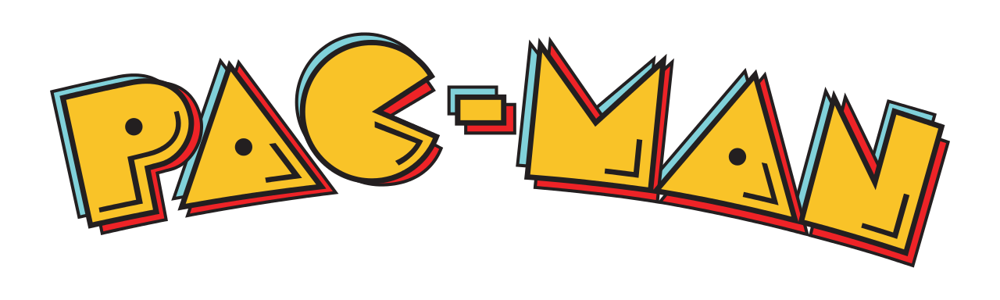
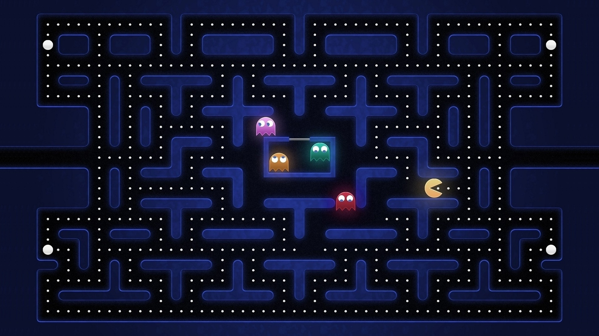
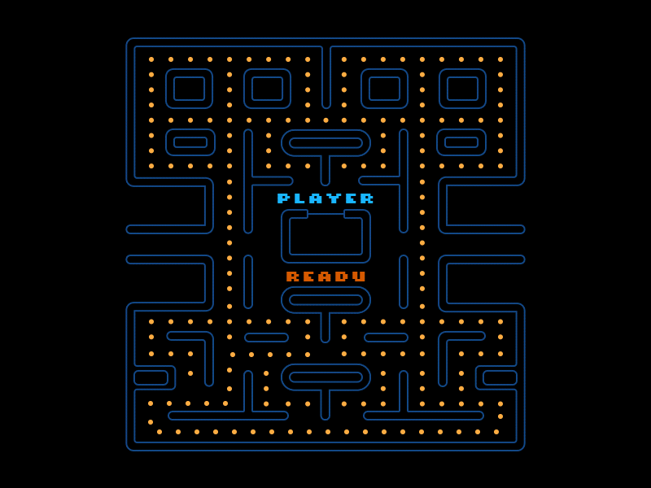

## Re Creators :

- SHAO Vincent.
- BERTINE Jeras.
- FERNANDO PRICARD Diron Polson.

## Table of Contents

- [Description](#description)
- [Features](#features)
- [Installation](#installation)
- [Usage](#usage)
- [Controls](#controls)
- [Screenshots](#screenshots)
- [Contributing](#contributing)

## Description

Pacman Game is a classic arcade game that brings back the nostalgia of the iconic Pacman character. Navigate through the maze, eat pellets, avoid ghosts, and try to achieve the highest score. This project aims to recreate the timeless gaming experience with a modern touch.

## Features

- Classic Pacman gameplay.
- Maze with pellets and power pellets.
- Ghost enemies with unique behaviors.
- Score tracking.
- Responsive and intuitive controls.
- Sound effects for an immersive experience.

## Installation

1. Clone the repository:

   ```bash
   git clone https://github.com/Ispekis/Project-ESGI-3SI-pacman
   ```

2. Navigate to the project directory:

   ```bash
   cd Project-ESGI-3SI-pacman
   ```

3. Compile the game:

   ```bash
   gcc -o pacman main.c
   ```

4. Run the game:

   ```bash
   ./pacman
   ```

## Usage

Navigate through the maze and enjoy the Pacman game implemented in C.

## Controls

- Use arrow keys to navigate Pacman (Up, Down, Left, Right).

## Screenshot



## Contributing

Contributions are welcome! If you'd like to contribute to the project, please follow the [contributing guidelines](CONTRIBUTING.md).

---

<p align="center">
  
</p>
